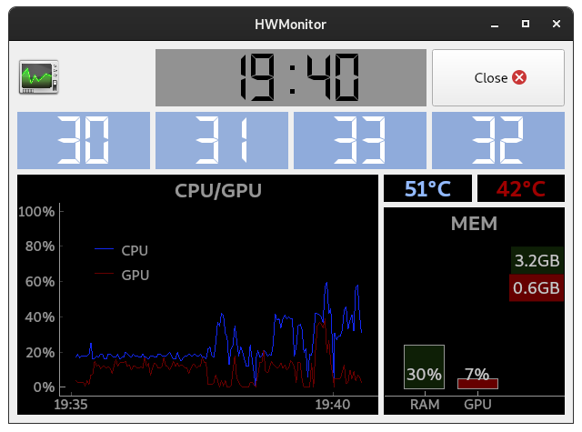
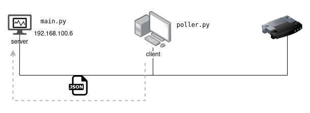

# rpi-hwmonitor-display
A Raspberry Pi client-server model hardware status monitor.




[](https://github.com/lajanki/rpi-hwmonitor-display/actions/workflows/run-tests.yml)

Displays client system's CPU, GPU and RAM usage metrics on a separate server device. Built with a Raspberry Pi as the server.

Hardware metrics are periodically collected from the client and sent to the server via a TCP socket over a local network.

System metrics monitored include:
 * Current CPU utilization :computer:
   * Overall CPU utilization percentage
   * 1 minute load average
   * Number of cores with high utilization
   * Individual CPU core utilization
 * CPU and GPU utilization graphs :chart_with_upwards_trend:
 * CPU and GPU temperatures :thermometer:
 * GPU and total system RAM usage :bar_chart:

## GPU device support
Both Nvidia and AMD Radeon GPUs are supported.

GPU metrics collection is based on device management library support provided by device drivers; [AMD SMI](https://rocm.docs.amd.com/projects/amdsmi/en/latest/index.html) for AMD and [NVML](https://developer.nvidia.com/management-library-nvml) for Nvidia.

For AMD devices you might need to install the library separately.


## Setup
In order to setup network connection between the client and the server, create a configuration file and specify the
server's (ie. the device running the monitor) local IP address:
```shell
cp config.tmpl.toml config.toml
```
```toml
[transport.socket]
host="192.168.100.4"
port=65432
```
The TCP port number can also be configured as needed. 

### Python setup
The Python project is managed with `uv`
 * https://docs.astral.sh/uv/

Install dependencies with
```shell
uv sync
```

### Note on PyQt5 installation
The user interface is built on the Qt framework. Installing the Python bindings for `PyQt5` on a Raspberry Pi
can be a bit challenging, as it has to be compiled from source. Building from the source includes a hidden
prompt for accepting its GPL license. The above install command may hang, and eventually be killed, due to this step.

To pass this prompt, install the dependencies instead with

```shell
uv sync --no-install-package PyQt5-Qt5 --config-settings-package "PyQt5:--confirm-license="
```
This will ignore the binary-only package `PyQt5-Qt5` which contains a `Qt` installation and is not needed
when building from source.

See the PyQt documentation for more installation instructions:
https://www.riverbankcomputing.com/static/Docs/PyQt5/installation.html


> [!NOTE]  
> On an older Raspberry Pi model compilation may take several hours!


## Run
First, start the monitor process on the server with:
```shell
uv run --no-sync main.py
```

Then, run the metrics poller on the client (or simply from another terminal window) with:
```shell
uv run --no-sync poller.py
```

> [!TIP]  
> For development purposes the TCP host can also be provided as a command line argument `--host` to both scripts.





## Note on Windows setup
Running the poller on Windows requires some additional preparations. The library used to poll CPU metrics on Linux,
`psutil`, has limited functionality on Windows. In order to retain it, polling on Windows relies on a 3rd party tool,
[LibreHardwareMonitor](https://github.com/LibreHardwareMonitor/LibreHardwareMonitor).
Download the monitor and run it in the background.
Having it automatically start on Windows startup is recommended.

## Unit tests
Unit tests can be run with:
```shell
uv run pytest
```


## Legacy: Running on Google Cloud infrastructure
An alternative transport mechanism is avialble for passing the hardware metrics to the server: Google Cloud Pub/Sub.
However, this is a legacy solution requiring more setup and offering no real benefit over a local network.
It can be useful when the client and the server are not in the same network.

To setup the Google Cloud infrastructure you need:
 * a [Google Cloud project](https://cloud.google.com/) with Pub/Sub enabled.
 * [Google Cloud SDK](https://cloud.google.com/sdk/docs/install) with `gcloud` command line tool.

Create a Pub/Sub topic with a subscription and a service account with the setup script `extras/setup_pubsub.sh`:
```shell
cd extras
./setup_pubsub.sh
```

This will also download a json key for the service account and set the `GOOGLE_APPLICATION_CREDENTIALS`
env variable in `extras/.env` which will be used to auhenticate to Google Cloud.
 * https://cloud.google.com/docs/authentication/application-default-credentials

Then, install Pub/Sub related dependencies with:
```shell
uv sync --extra pubsub
```

Finally, in order to run the poller and the server using Pub/Sub as transport, pass `--transport Pub/Sub` as an argument
to both invocations.


### Pub/Sub pricing
Pub/Sub's [pricing](https://cloud.google.com/pubsub/pricing) is (mostly) based on throughput (data published to and read from a topic).

A single message published is around `500B`. However, Pub/Sub will process a minimum of `1 000B` per call
 * https://cloud.google.com/pubsub/quotas#throughput_quota_units

Thus, running the poller and monitor constantly for 24 hours with the default refresh interval of 2 seconds
(ie. 43 200 messages) will process a total of `43 200 * 2 * 1kB = 86 400kB ~ 84MB`

There is a free tier where the first `10GiB` of throughput is free each month.
