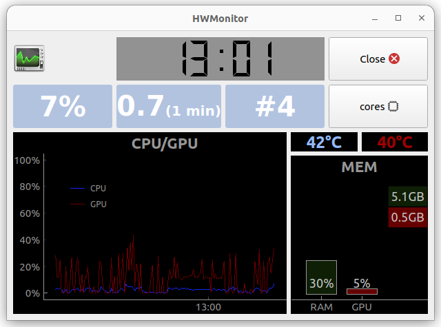

# rpi-hwmonitor-display
A system statistics monitor displaying host system's CPU, RAM and GPU statistics on a Raspberry Pi client. Host can be a Linux or a Windows system. Message delivery between host and client is based on Google Pub/Sub.

System statistics monitored include:
 * CPU core utilizations, frequences and temperatures(*),
 * used and available RAM,
 * Nvidia GPU core utilization and temperature and memory utilization (Non Nvidia cards are not supported)

<sub>(*)Only the first 4 CPU cores are displayed.</sub>




A hardware statistics poller running on the host system to monitor send the statistics to a Pub/Sub topic where the client pulls them and displays on a PyQt5 based GUI.

## Google Cloud Setup
To setup you need:
 * a [Google Cloud project](https://cloud.google.com/) with Pub/Sub enabled and a service account with editor access to it. 
 * [Google Cloud SDK](https://cloud.google.com/sdk/docs/install) with `gcloud` command line tool.

Then,
 * fill `.template_env` with your project id, path to a downloaded service account json key file and names for your Pub/Sub topic and subscription. Rename the file to `.env`.
 * Create the topic and subscription from the file
    ```
    source .env
    ./setup_pubsub.sh
    ```

## Python setup - Ubuntu
Install dependencies with
```
pip install -r requirements.txt
```

## Run
To run the statistics poller:
```
python hw_poller.py
```
Then, run the monitor in a different terminal with
```
python main.py [--fullscreen]
```

## Windows setup
Running the poller on Windows requires some additional preparations. The library used to poll CPU statistics on Linux, `psutil`, has limited functionality on Windows. In order to retain it, polling on Windows relies on a 3rd party software, [Open Hardware Monitor](https://openhardwaremonitor.org/). Download the monitor and run it in the background. Having it automatically start on Windows startup is recommended.

Next, install Windows only dependencies with
```
pip install -r requirements_win.txt
```

You can now run `hw_poller.py` with the above command.


## Poller configuration and Pub/Sub pricing
Polling frequency can be adjusted in `.env`. If not set, a default value of 5 will be used which means statistics are polled, and a message is published to the Pub/Sub topic every 5 seconds.

Pub/Sub's [pricing](https://cloud.google.com/pubsub/pricing) is based on data sent with a minimum of 1000 bytes per publish. This minimum is likely over the actual data sent. Thus, publishing and receiving a message every 5 seconds (or 12 times per minute) transmit a total of `12 * 2kB = 24kB` per minute. Running both the poller and the monitor constantly would then transmit `24 * 60 * 24kB = 34560kB ~ 35MB` per day, roughly `1 GB / month`. 

There is a free tier where the first 10 gigabytes of usage each month are free.